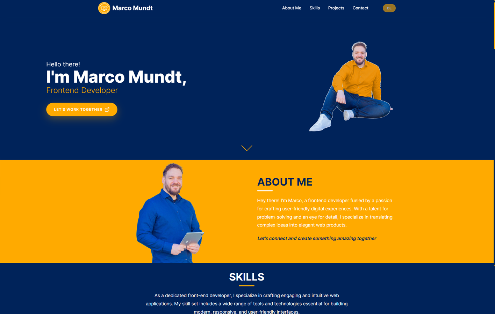

# 🧑‍💻 Marco Mundt – Portfolio (Angular)

Ein responsives und modernes Entwickler-Portfolio, gebaut mit Angular. Präsentiert Skills, Projekte und Kontaktmöglichkeiten – alles in einer sauberen, modularen Struktur.

---

## 🚀 Features

- 🌐 One-Pager mit dynamischer Navigation
- 🎨 Responsives UI-Design mit Fokus auf Lesbarkeit und Struktur
- 💼 Projektsektion mit GitHub- und Live-Links
- ✍️ Kontaktformular mit Formularvalidierung
- 🧩 Modulare Angular-Komponentenstruktur
- 🌓 Darkmode optional (zukünftige Erweiterung möglich)

---

## 🔧 Tech Stack

`Angular` · `TypeScript` · `SCSS` · `HTML` · `Firebase (Kontaktformular geplant)`  
Design erstellt mit Figma

---

## 📁 Projektstruktur

- `src/app/` – Komponenten für Skills, Projects, Hero, Contact usw.  
- `src/assets/` – Icons, Logos, Screenshots  
- `src/styles/` – globale Styles & Variablen  
- `public/` – Favicon & statische Inhalte  

---

## 📷 Vorschau

---

## 📬 Kontakt

🌐 [www.mundtwerk.com](https://www.mundtwerk.com)  
📷 [Instagram](https://instagram.com/marcomundtwerk)  
💼 [LinkedIn](https://linkedin.com/in/marco-m-3059952b4)

---

> Entwickelt 2025 – mit Leidenschaft für Design, Struktur & moderne Webtechnologien.
